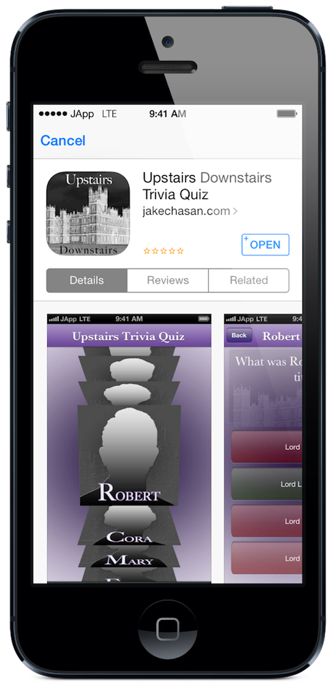
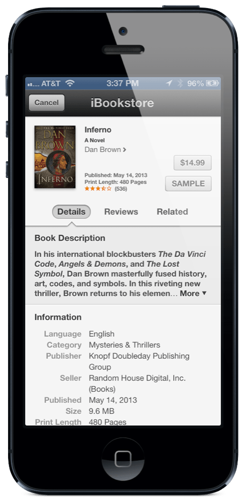
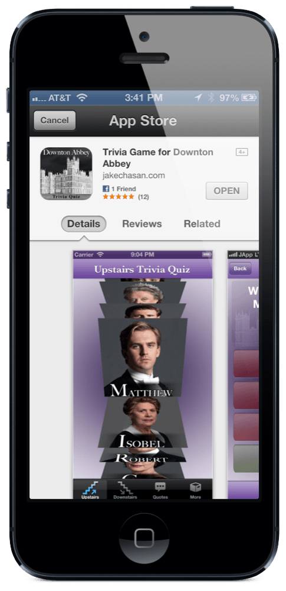
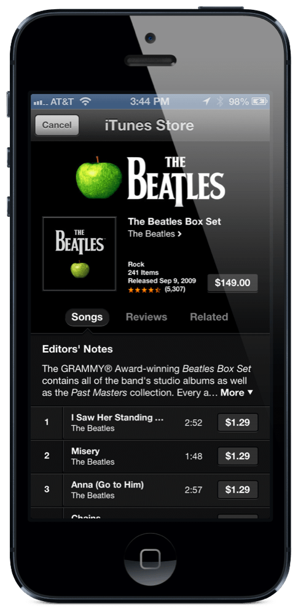

# App and iTunes Store Viewer Plugin for the Buzztouch Platform

## About Plugin
### Description
This plugin allows the user to view an item in the App Store or iTunes Store without leaving the app. Simply enter the iTunes ID of the content and this plugin will display the iTunes Store. The user can install apps or download other iTunes items directly through this plugin. Previously a user would have to leave the app to view the iTunes Store. Once a user has left your app, they may never come back, however, this plugin will keep them within your app.

### Version History
v1.0-Initial Release of Plugin

v1.1-Compatibility with BT4.0 and iOS 10

### iOS Project
JC_StoreViewer.h

JC_StoreViewer.m

StoreKit.framework (Automatically added with Source Code Download)

### Android Project
This plugin is not compatible with Android.

### JSON Data
`{
"itemId":"454552A283882814D155B03",
"itemType":"Jc_storeviewer",
"itemNickname":"iTunes",
"transitionStart":"YES",
"transitionEnd":"YES",
"iTunesItemID":"624628271",
"navBarTitleText":"iTunes"
}`

## Screenshots

## Installation
If a previous version of this plugin is installed on your server that was downloaded from the Buzztouch Plugin Market, we reccomend that you delete this plugin's folder under /filed/plugins/ and then upload the new package and refresh your plugin list.

## Questions and Answers
Can I use this plugin on my self-hosted Buzztouch account?

*Yes, you can download the plugin from this repository as a zip file, and upload it to your Buzztouch self-hosted Control Panel*

Can I use this plugin on apps hosted at Buzztouch.com?

*Yes, but you must install it through the [Buzztouch Plugin Market](http://www.buzztouch.com/plugins/plugin.php?pid=2E738E5CD8DDF9D761CCBE1).*

## Collaboration
To become a collaborator with this project, please contact us on either our [Twitter](http://twitter.com/jakechasan) or our [Facebook](http://facebook.com/jakechasanapps) pages.

## Support
For support and further questions, please contact us on either our [Twitter](http://twitter.com/jakechasan) or our [Facebook](http://facebook.com/jakechasanapps) pages.

Support is also availible from other Buzztouch users on the [Buzztouch Forums](http://www.buzztouch.com/forum/).